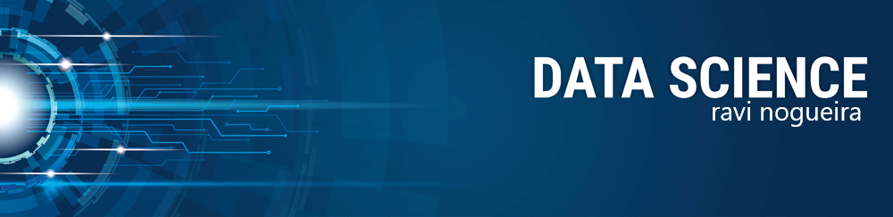

  

# Ravi Nogueira
*Cientista de Dados* no Centro de Inteligência Analítica - CIA da Algar Telecom

Como um cientista de dados combino habilidades analíticas, curiosidade, pensamento crítico, capacidade de trabalhar em ambientes de equipe e atenção aos detalhes. Tendo passado os últimos anos aplicando Aprendizado de Máquina aos problemas reais de uma empresa do setor de Telecomunicações, desenvolvi um pensamento crítico e habilidade de resolução de problemas.

**Background in:** Python, Machine Learning, Business Intelligence, Analytics

**Links:**
* [LinkedIn](https://www.linkedin.com/in/ravi-nogueira-8482a7ab/)

## Projetos:
Veja abaixo alguns projetos simples que fiz para transmissão de conhecimento:

* **Detecção de fraudes em Cartões de Crétido:** https://bit.ly/33Ytqam
